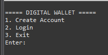
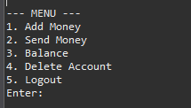
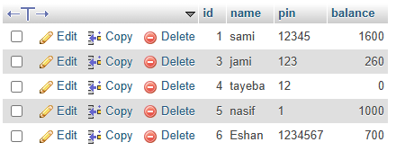

# Digital Wallet System

A console-based Digital Wallet System built using Java, JDBC and MySQL.

## Features

- Create Account
- Secure Login Authentication
- Add Money
- Send Money
- Balance Management
- Delete Account
- MySQL Database Integration

## Technologies Used

- Java
- JDBC
- MySQL
- OOP Concepts
- Exception Handling

## Screenshots

### Main Interface

### User Menu

### Database Integration (phpMyAdmin)

